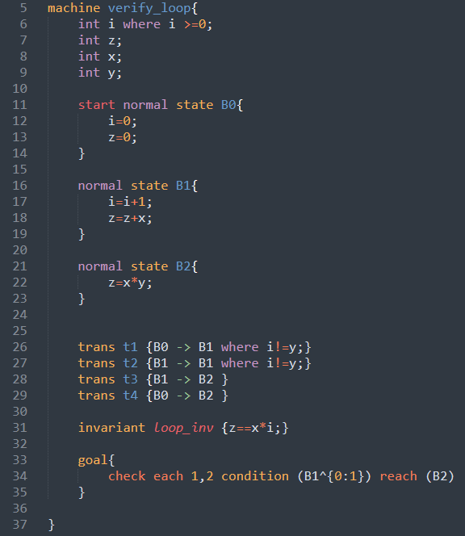

## Cyclone Sublime Package [Lastest update: 30-May-2022]
### Syntax highlight for the following language features:
* One predicate
* Anonymous edges
* constants & variables
* Standard logic/arithmetic/boolean operators
* Path operators
* assert/invariant/where statements
* fresh/initial statements
* always/some quantifiers
* options

### Donwload & Installation
Install this package to highlight [cyclone](https://classicwuhao.github.io/cyclone_tutorial/tutorial-content.html) syntax in your [sublime text editor](https://www.sublimetext.com/). 

0. If you have already installed `Package Control`, jump to step 5.
1. To install Package Control, Open the command palette `win/linux: ctrl+shift+p, Mac:cmd+shift+p`.
2. Type `Install Package Control`, and press enter.
3. This will install `Package Control` for your sublime.
4. Restart your sublime text editor.
5. Download [Cyclone.sublime-package](Cyclone.sublime-package).
6. Click `Preferences -> Browse Packages...` menu.
7. **Browse up** a folder and then into the `Installed Packages` folder (it should be under folder `Sublime Text`).
8. Copy [Cyclone.sublime-package](Cyclone.sublime-package) into the `Installed Packages` folder.
9. Restart your sublime text editor.

## Screenshots

<!-- img src="./screenshots/sublime_screenshot2.png" width=75% height=75%-->

