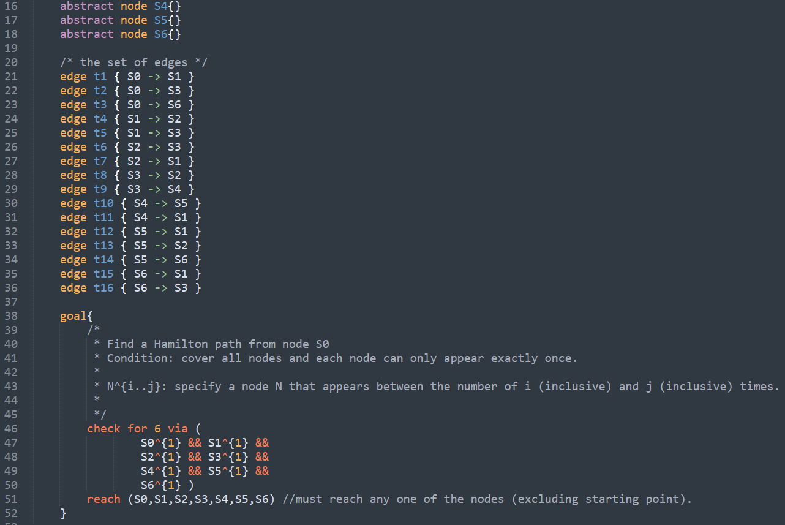
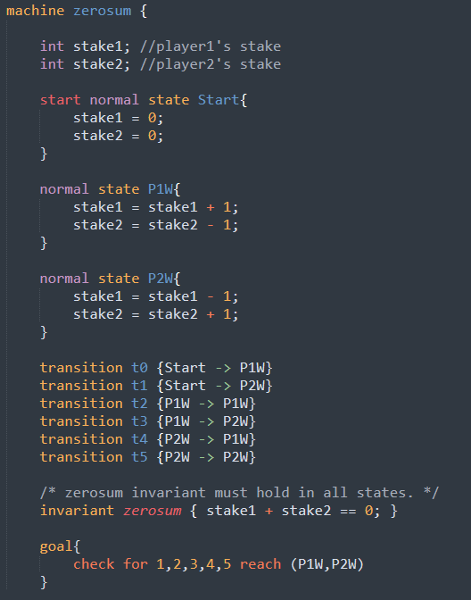
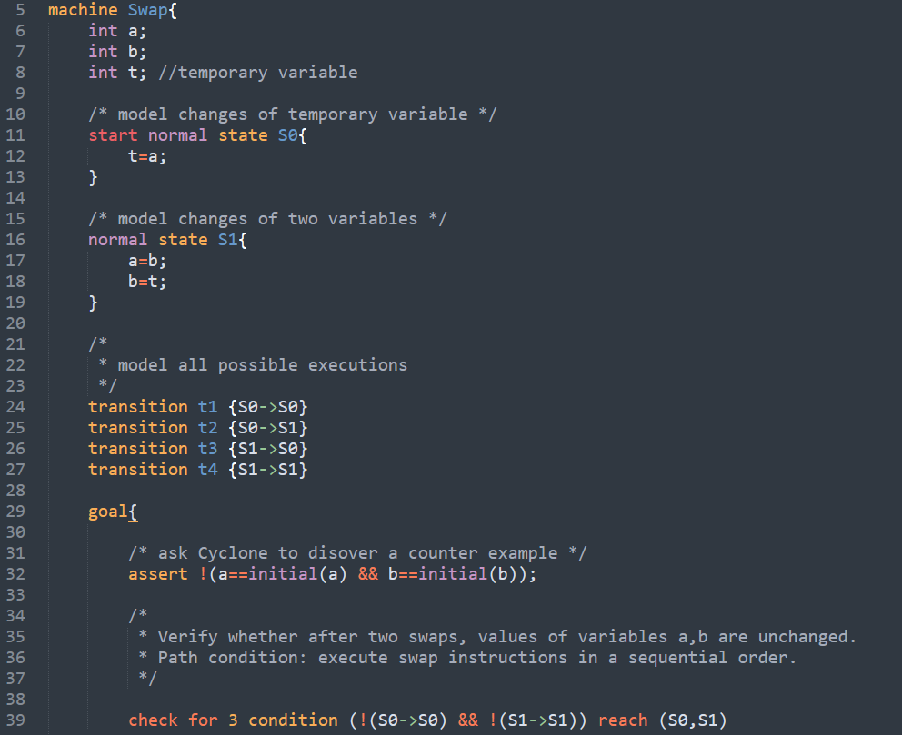
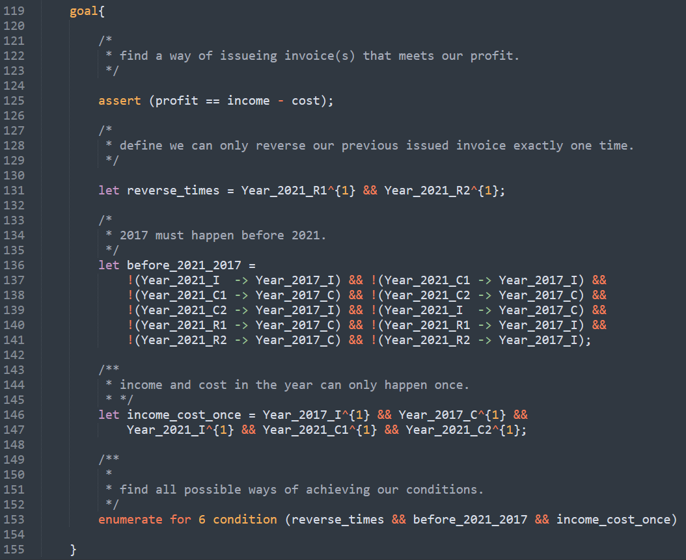

## Cyclone Sublime Package 
Install this package to highlight cyclone syntax in your sublime text editor.

0. If you have already installed `Package Control`, jump to step 5.
1. To install Package Control, Open the command palette `win/linux: ctrl+shift+p, Mac:cmd+shift+p`.
2. Type `Install Package Control`, and press enter.
3. This will install `Package Control` for your sublime.
4. Restart your sublime text editor.
5. Donwload [Cyclone.sublime-package](Cyclone.sublime-package).
6. Click `Preferences -> Browse Packages...` menu.
7. Browse up a folder and then into the `Installed Packages` folder.
8. Copy [Cyclone.sublime-package](Cyclone.sublime-package) into the `Installed Packages` folder.
9. Restart your sublime text editor.

## Screenshots

